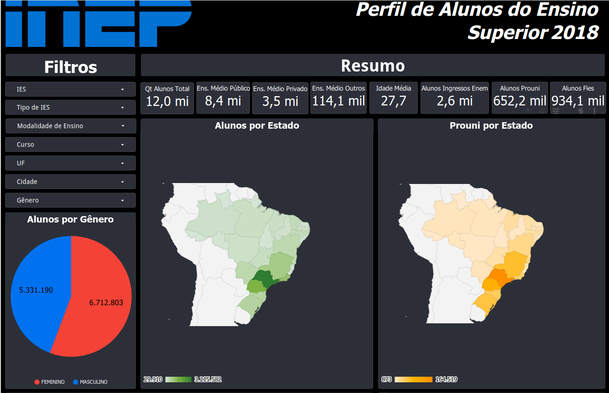
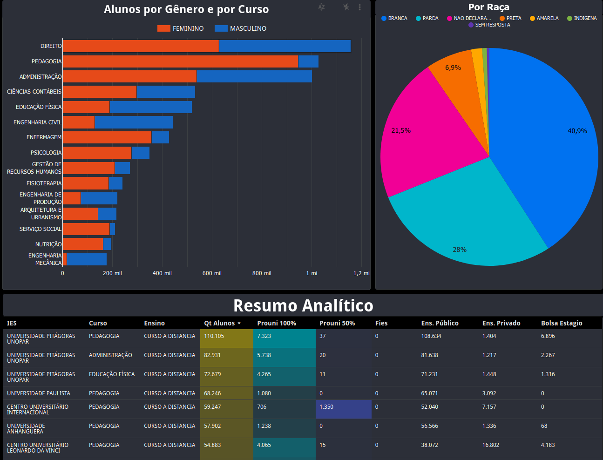
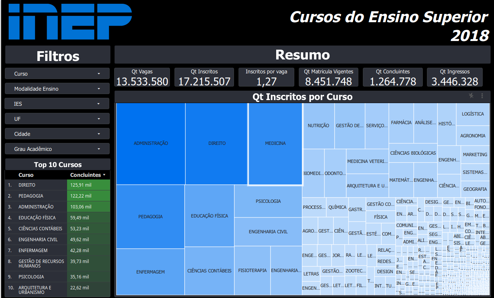
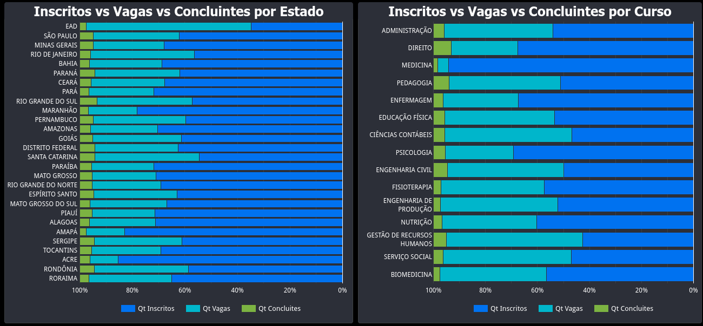
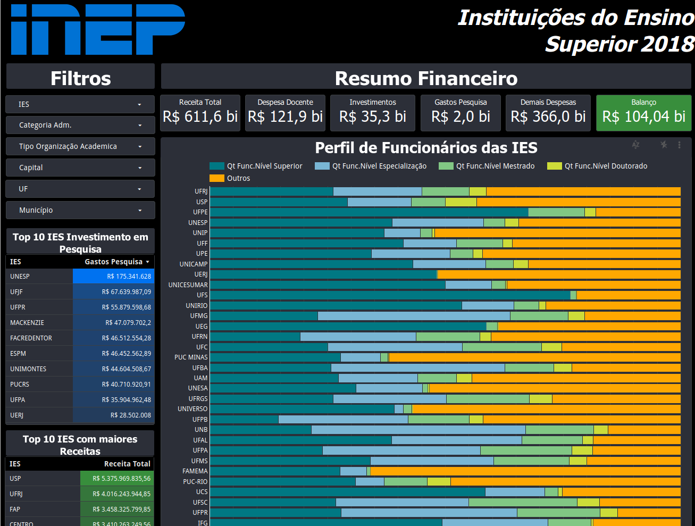
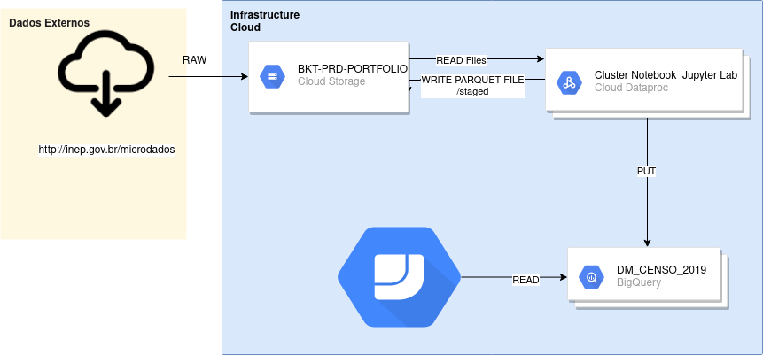

[![Py][python-image]][python-url]

# Censo Educacional de Ensino Superior de 2018
O projeto tem como objetivo realizar análise exploratória de grandes dataset utilizando PySpark, infraestrutura Cloud, e tecnologias emergentes de Big Data. 
Foi desenvolvido como produto final Dashboards interativos utilizando a ferramenta [Data Studio](https://datastudio.google.com/) da Google.

- O link do relatório [está aqui](https://cutt.ly/tioBR5U) 

### Screenshots do relatório

# Arquitetura 

## Requisitos/Conhecimentos:
- [Free Tier GCP](https://cloud.google.com/)
- [Python 3.x](https://www.python.org/)
- [Spark](https://spark.apache.org/)
- [Big Query](https://cloud.google.com/bigquery)
- [GCloud](https://cloud.google.com/sdk/install)

## Considerações:
- Na pasta infra_gcp, se encontra script shell para executar os comandos de crianção do Data Proc, cluster que irá rodar o script Spark. Também o de criação do bucket(Google Storege) no seu projeto. E por fim o de copia de arquivos do [INEP](http://inep.gov.br/microdados) para o Bucket.
- Na pasta data possui outro script shell para obter os dados do INEP.

- Por fim o diretório script-spark possui o notebook que deverá ser executado no cluster do dataproc.

## Histórico de Versão

* 0.0.1
    * CHANGE: Commit project

## Developer

Lucas Mari – [@LHRM97](https://twitter.com/LHRM97) – lucashrm97@gmail.com

[https://github.com/Amglsox](https://github.com/Amglsox/)

<!-- Markdown link & img dfn's -->
[gcp-url]: https://cloud.google.com/
[python-image]: https://camo.githubusercontent.com/1ffe5b1d477c7a0a8c3a954048fb57d676ac1614/68747470733a2f2f696d672e736869656c64732e696f2f707970692f707976657273696f6e732f6b756265726e657465732e737667
[python-url]: https://www.python.org/